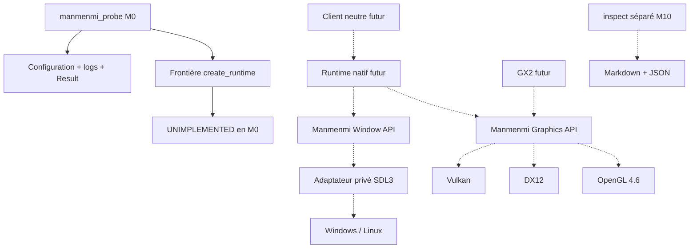

# Architecture M0

**DOCUMENTED — décisions du projet**, pas description de l'implémentation Wii U.
Les pointillés représentent exclusivement des éléments **PLANNED**.



## Graphe des dépendances de compilation actuel

```text
manmenmi_probe ──> manmenmi::core ──> bibliothèque standard + Threads système
manmenmi::window ──> manmenmi::core       (INTERFACE, pas de .cpp)
manmenmi::graphics ──> manmenmi::core     (INTERFACE, pas de .cpp)
tests ──> ces trois cibles
```

`core` ne dépend d'aucun backend ni bibliothèque de fenêtre. Aucun lien direct
entre les cibles publiques fenêtre et graphique. Le nom du backend est une
préférence portable de configuration, jamais un objet API natif.

## Décisions

- **DOCUMENTED — ADR-001 :** C++20/CMake/Ninja/Clang, Windows x64 et Linux x64.
  Tests autonomes CTest M0 ; GoogleTest facultatif à partir de M2 après justification.
- **DOCUMENTED — ADR-002 :** pas de CPU invité ni de sémantique de mémoire Cafe
  en M0. Les pointeurs hôtes ne seront pas présentés comme adresses invitées.
- **DOCUMENTED — ADR-003 :** SDL3 prévu derrière `window`; aucun `SDL_Window*`
  dans l'API. Version/obtention à figer dans une décision M1 avant intégration.
- **DOCUMENTED — ADR-004 :** pas de Vulkan-centric IR. Les futures commandes
  décriront une intention portable, pas une copie des barrières Vulkan.
- **DOCUMENTED — ADR-005 :** GX2 ne choisit pas un backend et n'inclut aucun
  header de backend. Les limites apparaîtront dans les capacités et erreurs.
- **DOCUMENTED — ADR-006 :** les projets de recherche inspirent la séparation
  des responsabilités, jamais une dépendance ni une reprise de code implicite.
- **DOCUMENTED — ADR-007 :** `inspect` aura sa propre cible, désactivée par défaut,
  et aucune dépendance inverse depuis le cœur. Aucune entrée dump dans CMake M0.
- **DOCUMENTED — ADR-008 :** pas de plugin binaire/ABI stable promis en M0.
  Les contrats source sont minimaux et versionnés dans le dépôt, pas figés pour M2.

## Pont fenêtre / graphique à résoudre en M1

**INFERRED — proposition non implémentée :** le runtime concrétisera l'assemblage
par un adaptateur privé de présentation. Celui-ci pourra consulter les handles
de fenêtre natifs **uniquement dans les implémentations privées**. Aucune méthode
publique `void* native_handle()` n'est ajoutée pour contourner le découplage.
Les exigences OpenGL (contexte/affinité de thread) et Vulkan (surface/extensions)
doivent être étudiées avant de stabiliser ce pont.

**UNKNOWN :** boucle d'événements, redimensionnement/minimisation, HiDPI,
ownership d'un contexte GL, destruction GPU, gestion des pertes de périphérique,
threading et synchronisation. Aucun résultat M0 ne les valide.

## Ordre de construction ultérieur, pas implémenté

M1 fenêtre/present → M2 ressources/commandes/IR minimale → M3 triangle/parité →
M4 GX2 ciblé/sandbox → M5 tests GX2 → M6 sous-ensemble shaders → M7 layouts →
M8 Cafe → M9 client externe neutre. M10 inspection séparée. M11+ intégrations
externes uniquement après preuves ; aucune logique Splatoon dans `core`.